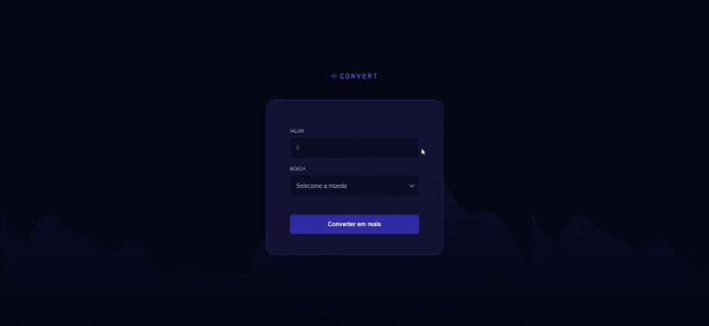

# 💱 Projeto Convert 💱
Projeto desenvolvido durante Formação Full-Stack promovida pela Rocketseat.
___
## 💹 Layout direcionado para aplicações de conversão de valores monetários
  

  
___
### 🤖 Tecnologias e Recursos  
  
* HTML
* CSS
* JavaScript
* Git
* Figma

#### 🔎 Você pode conferir o resultado clicando [aqui](https://arturtinoco.github.io/convert/) ou ver o projeto no [Figma](https://www.figma.com/community/file/1360315742205904074) feito por [Millena Martins](https://www.linkedin.com/in/millenamartins/).  